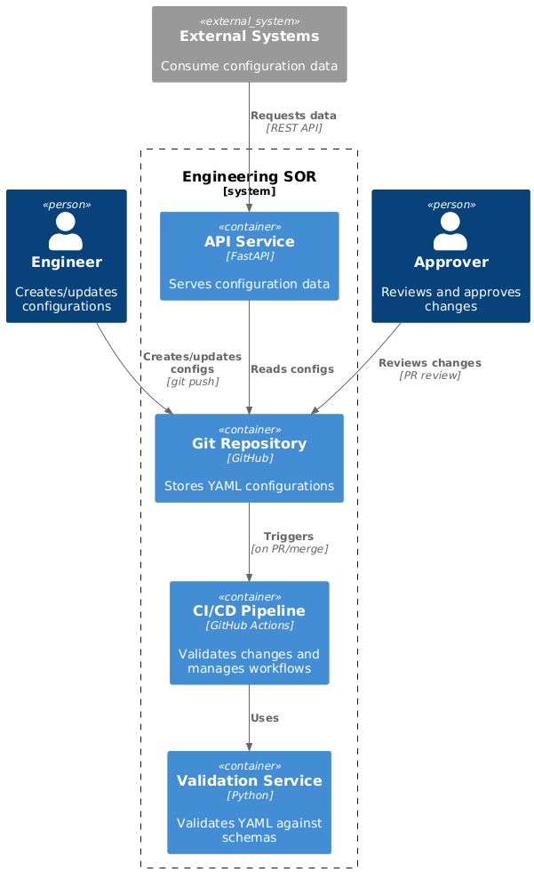
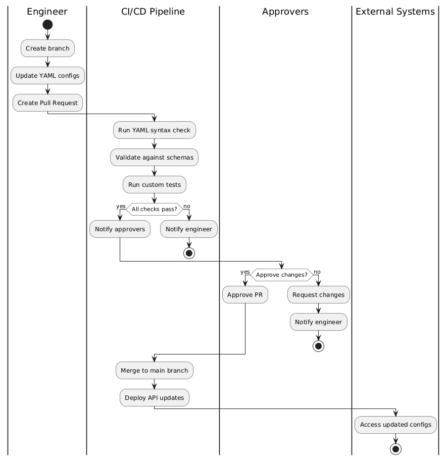
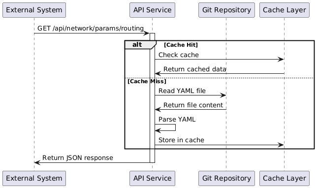
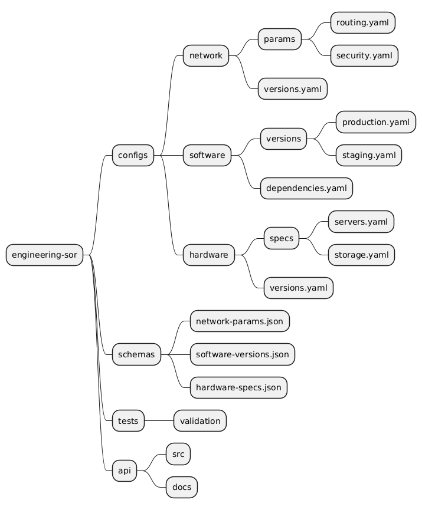
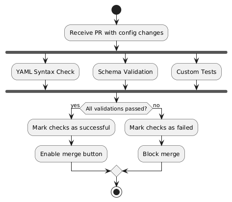

These diagrams provide different views of the system:
1. The Component Overview shows the main system components and their interactions
2. The Approval Workflow details the step-by-step process for making changes
3. The Directory Structure visualizes the organization of files
4. The API Request Flow shows how external systems interact with the API
5. The Validation Process illustrates how changes are validated

Each diagram helps understand different aspects of the system:
- Architecture and components
- Processes and workflows
- Data organization
- Integration points
- Validation mechanisms

These views help different stakeholders understand the system from their perspective:
- Engineers understand the change process
- Approvers see their role in the workflow
- API consumers understand how to interact with the system
- DevOps teams understand the deployment and validation process

